# SHOP EASY


[Here is a link to the final project](https://ms4-store.herokuapp.com/)

This site is a printer and cartridges e-commerce site for my fried who owns small business in Russia. Website eventually would bee translated in to russian. This site is fully responsive on all modern screen sizes, and it allows the admin to easily add, edit or delete products that he have to sell.

This site was built using HTML, CSS, Bootstrap, JavaScript, jQuery, Python, Django, and it uses a SQL database through PostgreSQL.

---
# Contents

- [SHOP EASY](#shop-easy)
- [User Experience](#user-experience)
  * [Initial Discussion](#initial-discussion)
  * [Site Owner's Goals](#site-owners-goals)
  * [First Time Visitor Goals](#first-time-visitor-goals)
  * [Returning Visitor Goals](#returning-visitor-goals)
  * [Frequent User Goals](#frequent-user-goals)
- [UI](#ui)
- [Wireframes](#wireframes)
- [Database Schema](#database-schema)
- [Database Model](#database-model)
- [Deployment](#deployment)
- [Technologies Used](#technologies-used)
  * [Languages Used](#languages-used)
  * [Frameworks, Libraries & Programs Used](#frameworks-libraries--programs-used)
- [Testing](#testing)
  * [Testing User Stories from User Experience (UX) Section](#testing-user-stories-from-user-experience-ux-section)
    + [First Time Visitor Goals](#first-time-visitor-goals-1)
    + [Returning User Goals](#returning-user-goals)
    + [Frequent User Goals](#frequent-user-goals-1)
  * [Further Testing](#further-testing)
  * [Code Testing](#code-testing)
  - [Known Issues](#known-issues)
- [Problems encountered](#problems-encountered)
- [Credits](#credits)
  * [Code](#code)
  * [Content](#content)
  * [Media](#media)
- [Acknowledgements](#acknowledgements)


---

# User Experience

## Initial Discussion

* I wanted to create a website linked to a database, which allows users to log in, search for, and find printers and cartridges for them.
* Currently, I have a basic one-page website, and I think it's a time to upgrade to bring more customers in, and be able to manage products more easily
* I wanted to be able to add, edit and delete items of products for sale.

## Site Owner's Goals
 - As a site owner, I want to be able to add new or edit existing products.
 - As a site owner, I want to be able to remove existing products.
 - As a site owner, I want to be able to add new/existing products to "special offers/sale".
 - As a site owner, I want to be able to add new, edit or remove existing categories and brands.

## First Time Visitor Goals
 - As a First Time Visitor, I want to be able to view a list of products, so that I can select some to purchase.
 - As a First Time Visitor, I want to be able to view individual product details, product Image, the price, the product description and the compatible cartridges.
 - As a First Time Visitor, I want to look for testimonials to understand what other users think of the site and the service it renders.
 - As a First Time Visitor, I want to sign up to the site to enable me full access to it's service and also to receive email newsletter and latest updates.

## Returning Visitor Goals

  - As a Returning Visitor, I want to see new products and deals.
  - As a Returning Visitor, I want to find the best way to get in contact with the site owner with any questions I may have.
  - As a Returning Visitor, I want to be able to log in to the site view my profile and add items to wishlist.

## Frequent User Goals
 - As a Frequent User, I want to browse the site to see if there are any changes, new deals and/or clearance items.
 - As a Frequent User, I want to see information about the most new arrivals and sales.
 - As a Frequent User, I want to be able to sort products by price, category, or brand


---

# UI
- A responsive Navbar
- A search function for users to find available products
- A registration/login form for the first time and returning users
- A loading page was implemented to stop poor impressions from data loading slowly
- A footer to provide some information and social links
- Forms for the admin to add new or modify existing products

# Wireframes
Wireframes are my initial design, so you may notice that the final website design does not contain everything that was planned at the start of the project. Some missing features are possible future improvements for the project. They may be implemented at a later stage.
Wireframes for the desktop and tablet uses same layout, while on mobile screen layout is rearranged.
 - [Wireframes_desktop_tablet.pdf](./readme_media/wireframes.pdf)
 - [Wireframe-mobile](./readme_media/mobile.png)

# Database Schema
I started planning the database after I have done my wireframes to justify which fields I would require and what collections I would have to use. After the initial discussion with my mentor, I have settled with the current database schema.
 - [Database.pdf](./readme_media/database_diagram.png)
 - [View diagram on dbdiagram.io](https://dbdiagram.io/d/6186a3a8d5d522682dfb80c9)

# Database Model
- [Database model](./readme_media/database_model.pdf)


---
# Deployment

Detailed deployment can be found [here](https://github.com/alexandergrib/ms4-store/blob/main/readme_media/docs/deployment.md)


---
# Technologies Used

## Languages Used

-   [HTML5](https://en.wikipedia.org/wiki/HTML5)
-   [CSS3](https://en.wikipedia.org/wiki/Cascading_Style_Sheets)
-   [Jquery](https://en.wikipedia.org/wiki/Jquery)
-   [Python3](https://en.wikipedia.org/wiki/Python_Programming_Language)

## Frameworks, Libraries & Programs Used

1. [Bootstrap 5.x:](https://getbootstrap.com/)
    - Bootstrap 5.x was used to assist with the responsiveness and styling of the website.
2. [Font Awesome 5:](https://fontawesome.com/)
    - Font Awesome was used on all pages throughout the website to add icons for aesthetic and UX purposes.
3. [jQuery:](https://jquery.com/)
    - jQuery came with bootstrap to make the navbar entire site responsive.
4. [Git](https://git-scm.com/)
    - Git was used for version control by utilizing the Gitpod terminal to commit to Git and Push to GitHub.
5. [GitHub:](https://github.com/)
    - GitHub is used to store the projects code after being pushed from Git. 
6. [Balsamiq:](https://balsamiq.com/)
    - Balsamiq was used to create the [wireframes](https://github.com/) during the design process.
7. [Heroku:](https://heroku.com/)
    - Heroku was used to create  and deploy our app.    
8. [Django:](https://django.com/)
    - Django was used to create the framework.
9. [Postgresql:](https://postgresql.org/)
    - Mongodb was used to create database and to connect server to our site.
10. [Stripe:](https://stripe.com/)
    - Stripe was used to accept and authorise payment for any item purchased on the site.
11. [AWS:](https://s3.console.aws.amazon.com/)
    - Amazon S3 was used to manage and save media and collectstatic file in Its cloud service.        
12. [TinyMce](https://www.tiny.cloud/)
    - To create rich text editor for the text field for user to be able to create pretty text.

---


# Testing

The W3C Markup Validator and W3C CSS Validator Services were used to validate every page of the project to ensure there were no syntax errors in the project.

-   [W3C Markup Validator](https://jigsaw.w3.org/css-validator/#validate_by_input) - [Results](./readme_media/w3_html_check.png)
-   [W3C CSS Validator](https://jigsaw.w3.org/css-validator/#validate_by_input) - [Results](./readme_media/w3_css_check.png)
-   [Lighthouse](https://https://developers.google.com/web/tools/lighthouse) - [Results](./readme_media/lighthouse.png)

## Testing User Stories from User Experience (UX) Section

### First Time Visitor Goals

1. As a Shopper, I want to be able to view a list of products, so that I can select some to purchase.

     1. Upon entering the site. The homepage navigation bar have links to list of products and categories, user have the option to view all products or search for a specific product. 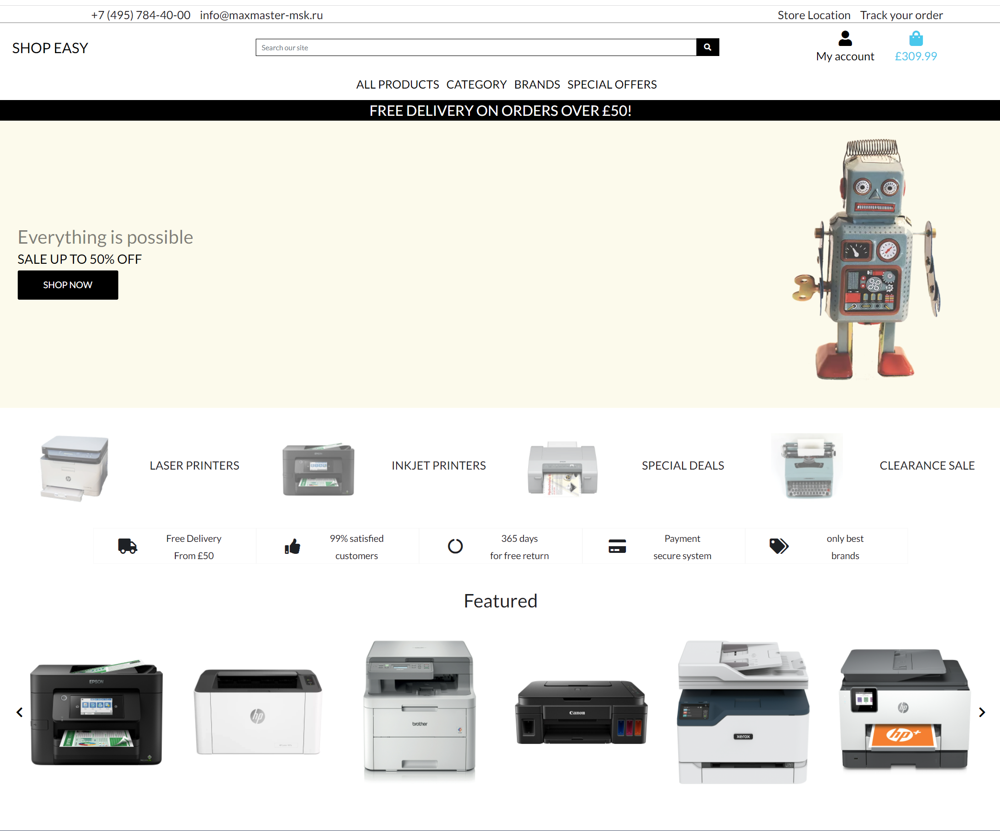

    
2. As a Shopper, I want to be able to view individual product details, product Image, the price, the product description and the compatible cartridges.
   1. By clicking on the featured product from the home page, or by viewing all products and selecting one uses can view detailed information about product <br> 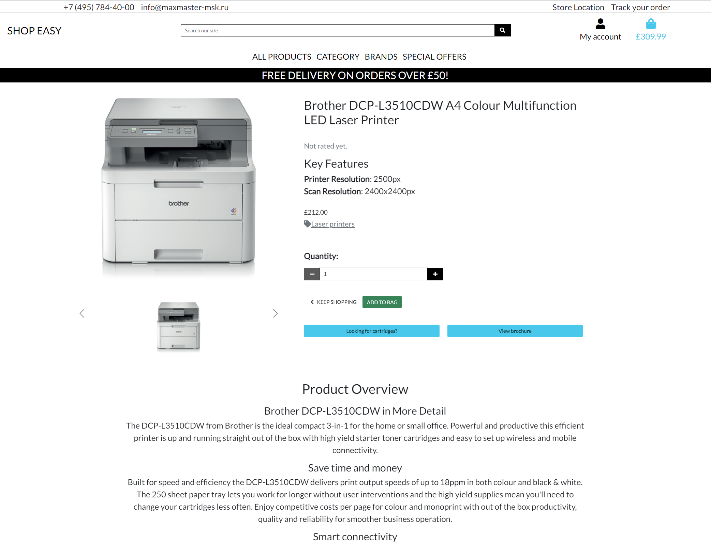
   
3. As a Shopper, I want to look for testimonials to understand what other users think of the site and the service it renders.
   1. By browsing all products or viewing detailed information about product user can view product rating which can be added by any registered user who has purchased this product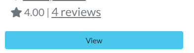
   2. By navigating on to the review page user can read detailed review if other users who left the review decided to leave detailed comment.<br> 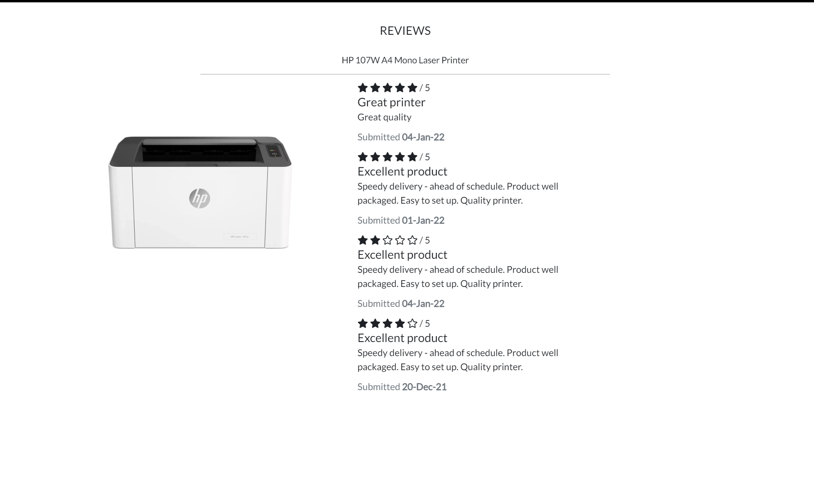
   3. Logged in users or administrators can edit or delete review. <br>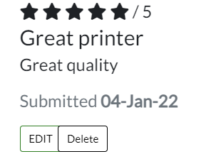 

4. As a Site User, I want to be able to register for an account and have a personalised user profile.

   1. The Site User can register to view their personal order history and order confirmations, and save their payment information by clicking on My Account icon on the homepage top-right as shown on the screenshot. <br> 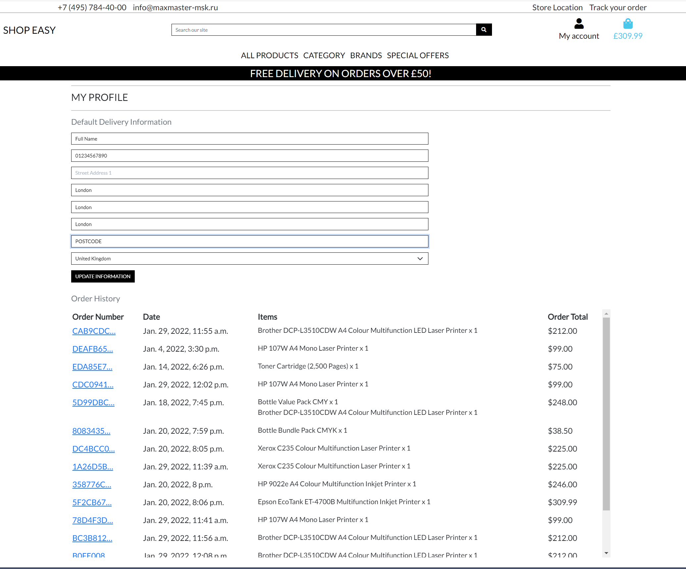

5. As a First Time Visitor, I want to locate the site contact details in case I may need help about the site service.
       
     1. The contact detail links is on the footer on every page of the site. ! <br> 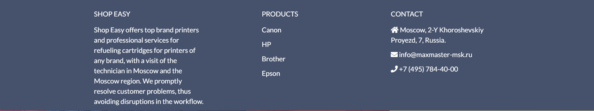
   

### Returning User Goals

1. As a Returning User, I want to see information about new products.

   1. Returning user can find new or featured products on the home page or click on New Arrivals link on the navbar. <br> 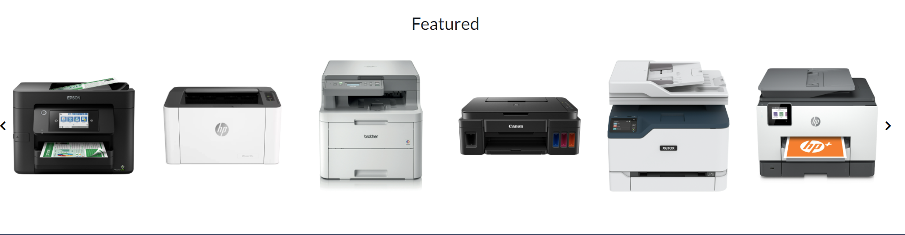 
    
2. As a Returning Visitor, I want to find the best way to get in contact with the site owner with any questions I may have.

   1. Returning Visitor can contact customer service through contact links on the footer of the site.
       
3. As a Returning User, I want to be able to log in to the site view my profile.
   1. User can view profile in My account section of the Navbar


### Frequent User Goals

1. As a Frequent User, I want to browse the site to see if there are any changes, new deals and/or clearance items.

   1. Frequent User can easily find this updates and contents on the home page. !

2. As a Frequent User, I want to see information about the most new arrivals and sales.

   1. The Special offers section is on the Navbar with links to the site New arrivals, deals and clearance.
   
3. As a Frequent User, I want to be able to sort products by price, category, or brand
   1. Option for sorting products located under all products view <br> 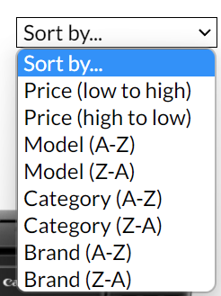
   2. Users can select product quicly by selecting brand of the product in the footer. <br> 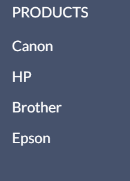


## Further Testing

-   The Website was tested on Google Chrome, Mozilla Firefox, Microsoft Edge and Safari browsers.
-   The website was viewed on a variety of devices such as Desktop, Laptop, iPhone SE, iPhone 11, One+ 9 Pro, and iPadPro.
-   A large amount of testing was done to ensure that all pages were linking correctly
-   Friends and family members were asked to review the site and documentation to point out any bugs and/or user experience issues.

## Code Testing

## **_Detailed functional code testing can be viewed here [TESTING](https://github.com/alexandergrib/ms4-store/tree/main/readme_media/docs/testing.md)_**

---

# Known Issues

- Windows 11 affecting styles of the dropdown menu's, forcing them to have rounded corners 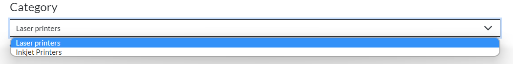
    * I was unable to fix this issue as this issue only occurs on Windows 11 and affected by windows itself. 
    * I tried many things in css to change this view but nothing seemed to work.

- When running django tests there is few errors shown: 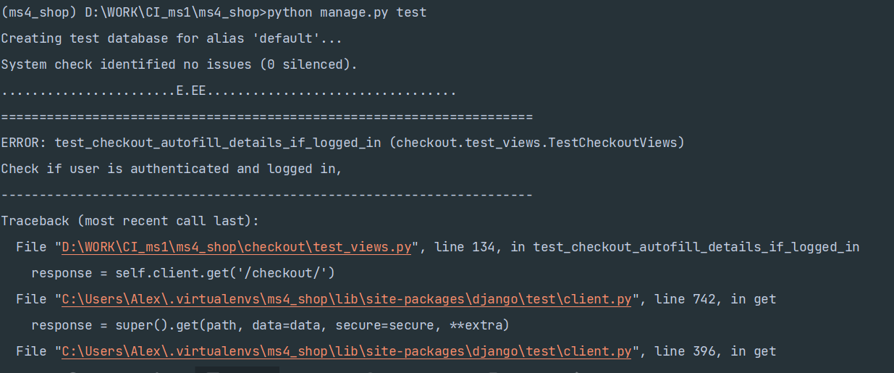
  - To fix this error I have to export STRIPE_PUBLIC_KEY and STRIPE_SECRET_KEY to make accessible in the terminal once they set, tests pass with no issues.

- Functionality for searching cartridges not implemented
  - Will be done ASAP after assessment completed.

- Page pagination needed for the products page.
  - pagination is less important for the MVP and would be implemented in the future.
  

# Problems encountered

- When checkout with selected update profile user 'Full name' was saved a tuple like so: ```('User Name',)``` instead of ```User Name```
  - **SOLVED** Problem was in the code where extra comma was added: 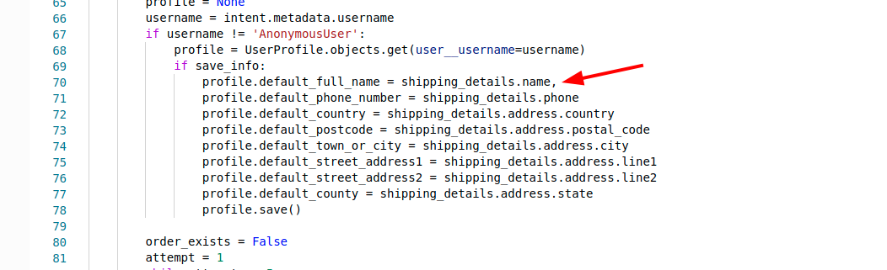

- When adding new cartridge with image uploaded and without selecting any related printer(even if it already highlighted in the box) cartridge wont get assigned to that printer.
- When adding new cartridge without selecting image it works fine.
  - As a temporary workaround, after saving new cartridge go to admin dashboard and reassign cartridge to the related printer. 
  - **SOLVED** Found bug in saving form where i was calling  ```image.save()``` instead of main form ```form.save()```
- W3 validator gave me warning:
- 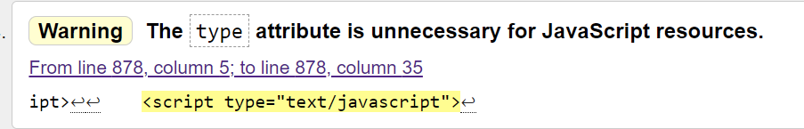
- To **solve** it i removed all ```type=text/javascript``` from ```<script>``` tags
---

# Credits

## Code

-   Code were copied and modified from the Full Stack Frameworks with Django, Boutique Ado Project and Hello Django Testing.

-   Bootstrap5 template was used throughout the project mainly to make site responsive using the [bootstrap 5](https://getbootstrap.com/)

## Content

-   All content was written by the developer.

## Media

-   All Images belong to the copyright owner.

# Acknowledgements

- Student Care and Tutor at Code Institute for their support.
- Deployment steps adapted to suit my project from [here](https://raw.githubusercontent.com/Abibubble/ms4-lead-shot-hazard)
- Some code testing was adapted to suit my project from [here](https://raw.githubusercontent.com/Abibubble/ms4-lead-shot-hazard)

