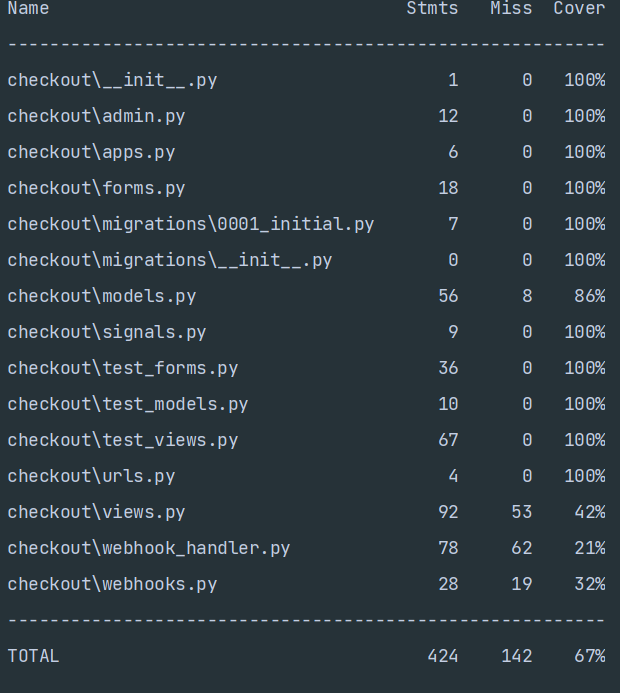

# Return to [README.md](https://github.com/alexandergrib/ms4-store/blob/main/README.md)
# Testing Steps

[Back to the top](#testing-steps)

---

## Automated Testing

Automated Unit Testing was done using [Django’s testing tools](https://docs.djangoproject.com/en/3.2/topics/testing/) and [Travis CI](https://www.travis-ci.com/)'s continuous integration testing functionality.

### Django Testing

### Bag app

#### Bag views

- Test the view_bag URL
- Test the add_to_bag URL
- Test that the add_to_bag view adds a product to the shopping bag
- Test the adjust_bag URL
- Test the remove_from_bag URL
- Test the add_to_bag view
- Test that the add_to_bag view updates the quantity of an item if it already exists in the bag
- Test the adjust_bag view
- Test that the adjust_bag view removes the item when the quantity is less than 1
- Test the remove_from_bag view
- Test that the remove_from_bag view throws an error if something goes wrong

#### Bag Others

- Test that the delivery cost is calculated correctly
- Test that the calc_subtotal function works

#### Coverage Report

---

### Checkout App

#### Checkout Forms

- Test that full name is required
- Test that email is required
- Test that phone_number is required
- Test that country is required
- Test that town_or_city is required
- Test that street_address1 is required
- Test that the form fields are correct in the Meta class

#### Checkout Models

- Test that the order string method returns the order number
- Test the checkout_details model
- Test the update_total model
- Test that the OrderLineItem string method returns the correct string

#### Checkout Views

- Test the cache_checkout_data view
- Test that the Checkout page URL exists
- Test that the Checkout page URL is accessible by name
- Test that the Checkout page uses the correct template
- Test that an error displays when there is nothing in the shopping bag
- Test that an error displays when the Stripe key isn't set
- Test the get in the checkout view
- Test that the user's details are autofilled if the user is logged in and has saved information

#### Coverage Report

---

### Home App

#### Home Views

- Test that the Home page URL exists
- Test that the Home page URL is accessible by name
- Test that the Home page uses the correct template

#### Coverage Report

---

### Products App

### Products Models

- Test the product name
- Test the product description
- Test the product has_sizes
- Test the category name
- Test the category friendly_name

### Product Views

- Test that the Products page URL exists
- Test that the Products page URL is accessible by name
- Test that the Products page uses the correct template
- Test the products page view

### Test the categories view

- Test the product_detail view
- Test that the product detail page URL exists
- Test the product sort functionality
- Test the product search functionality
- Test the product search error message shows correctly
- Test that a regular user cannot access the add a product page
- Test that add a product page displays for a superuser
- Test that a regular user cannot access the edit a product page
- Test that the edit a product page displays for a superuser
- Test that a regular user cannot access 'delete' product view
- Test that delete a product view works for a superuser

#### Coverage Report

---

#### Profile

##### Profile Forms

- Test that the user profile form fields aren't required
- Test the Meta class of the user profile form

##### Profile Models

* Test the getting user profile model

##### Profile Views

- Test that the Profiles' page URL exists
- Test that the Profiles' page URL is accessible by name
- Test that a logged-in user can view the profile
- Test that the profile information gets saved correctly
- Test that the order history displays when requested

#### Coverage Report

### Total Coverage Report

Whole project coverage looks good at 74%, but I have some functions missing at the moment, as im running close to the deadline, and I don't have enough time left to cover all possible cases. 

---

### Travis CI

[Click here to view the Travis CI full build report](../travis_build_history.png)

[Back to the top](#testing-steps)

---

## Manual Testing

### Website was tested on various browsers and devices

1. Google  Chrome
   1. Everything worked as expected
2. Mozilla Firefox
   1. Everything worked as expected
3. Microsoft Edge
   1. Everything worked as expected
4. Safari
   1. Everything worked as expected
5. Mobile Google Chrome
   1. Everything worked as expected
6. Mobile Samsung Browser
   1. Everything worked as expected
7. Ipad Mini
   1. Everything worked as expected

---

### Links and Navigation Testing

Icon key:
- 🔐 Superuser access only
- 🔑 Logged-in user access only
- 💻 Any user

#### Home Page

- 💻 Navigating to homepage
- 💻 Scroll featured gallery
- 💻 Click on the product image in the gallery navigates user to product detail page
- 💻 Click on the Category section navigates user to products page with filtering activated based on the product category selected
- 💻 Click on the Products' section in the footer navigates user to products page with filtering activated based on the product brand selected
- 💻 Click on the SHOP NOW button Navigates user to ALL products page
- 💻 Click on the logo from any page on the website navigates user to the home page
- 💻 Searching for the keyword navigates user to the product page with the result based on the search query
- 💻 Searching with empty query navigates user to the product page with no filters applied and displays error message (You didn't enter any search criteria!) 
- All above functionality is same for 🔑 and 🔐
- 🔐 Dropdown menu have extra options for the Category management and Brand management, my account have quick access to category, brand and product management.

#### Product Testing

- 💻 All product dropdown menu all products link, takes user to the products page
- 💻 All product dropdown menu By brand link, takes user to the products page with products filtered by brand
- 💻 All product dropdown menu By price link, takes user to the products page with products filtered by price ascending order
- 💻 All product dropdown menu By category link, takes user to the products page with products filtered by category

- 💻 All product page, filter dropdown menu > Price(Low to High), Price(High to Low), takes user to the products page with products filtered by price
- 💻 All product page, filter dropdown menu > Model(A to Z), Price(Z to A), takes user to the products page with products filtered by Model
- 💻 All product page, filter dropdown menu > Category(A to Z), Category(Z to A), takes user to the products page with products filtered by Category
- 💻 All product page, filter dropdown menu > Brand(A to Z), Brand(Z to A), takes user to the products page with products filtered by Brand

- 💻 Products Home link displayed after filters been applied and by clicking this link takes user to the all products page
- 💻 By clicking on the 'label icon' under any of the product will filter products by their category
- 💻 Clicking on the product image or 'VIEW' button will take user to the product detail page
- 💻 Clicking on the 'REVIEW' button will take user to the product reviews page

#### Products Detail Testing

- 💻 By clicking "Looking for cartridges?" will take user to the bottom of the page were available consumables available for this item
- 💻 By clicking "View brochure" will take user to the manufacturer website with more details about this product
- 💻 By clicking "Keep shopping" will take user to the all products page
- 💻 By clicking on the "+" or "-" button quantity of the product will change whiting the range of 1 and 99
- 💻 By clicking "Add to bag" product will be added to the bag with the quantity selected and notification will be displayed
- 💻 Consumables: by clicking on the title will take user to the consumable detail page
- 💻 Consumables: by clicking on the add to bag will add consumable to the bad and notification will be displayed
  
- 🔑 If user has purchased product and never reviewed it the "Leave your review" link will be displayed next to reviews score.
  
- 🔐 "Edit | Delete" will be visible under the product title
- 🔐 Clicking "EDIT" button will take superuser to the product edit page
- 🔐 Clicking "Delete" button will display superuser confirmation popup
- 🔐 "Add or Edit features" will be visible under the key features section
- 🔐 By clicking "Add or Edit features" will take superuser to the "PRODUCT SPECS MANAGEMENT" page
- 🔐 "Add cartridges" button will be visible under the Consumables section
- 🔐 By clicking "Add cartridges" button will display add new consumable form

#### Bag Testing

- 💻 By clicking on the "+" or "-" button quantity of the product will change whiting the range of 1 and 99
- 💻 By clicking 'update' price for the item will be updated based on the quantity selected total quantity also will be recalculated
- 💻 By clicking 'remove' product will be removed from the basket
- 💻 By clicking "Keep shopping" will take user to the all products page
- 💻 By clicking "Secure checkout" will take user to the checkout page

#### Checkout Testing

- 💻 Will requre to fill in their contact and address details to check out product
- 💻 Will be displayed links to register or login
- 🔑 If their details was saved previously they will auto filled in the form
- 🔑 Selecting "Save this delivery information to my profile" will update profile details upon checkout
- 💻 When checkout button pressed loading overlay will be displayed while server process data

#### Order Success Testing

- 💻 Click the Complete Order button and complete a purchase successfully to take the user to the Order Success page from the Checkout page.

#### Order Confirmation Testing

- 💻 'Now check out the latest deals!' button will take user to the special deals page

#### Profile Testing

- 🔑 Button 'Update information' will update user details
- 🔑 Order History should display previous user orders
- 🔑 Clicking on the order number link will take user to the order detail page

#### Product Management Testing

All items in this category is only available to the 🔐

- 'Add Another' Link under Category and Brand will take superuser to the add new Category/Brand page
- 'Description' and 'Featured description' Fields contain rich text editors
- Button 'Add product' will create new product if all *required fields are filled otherwise will display an error

#### Edit / Delete Product Testing

All items in this category is only available to the 🔐

- Product form fields are populated
- Button 'update product' will update current product if all *required fields are filled otherwise will display an error

#### Log Out Testing

- 💻 Click the Log Out button to log the user out and take them to the Home page

#### Log In Testing

- 💻 Click the Login button to take the user to the Login page

#### Register Testing

- 💻 Click the Register button to take the user to the Register page

#### Modals
- 🔐 The 'Delete' modal is visible in front of all other items on the screen, and clearly displays the Cancel and Delete buttons.
- 🔐 The 'Delete' modal only deletes the specific product that it is related to.

#### Styling and Layout
- Ensure all images load correctly.
- Ensure all images are correctly sized, and the correct aspect ratio is maintained.
- Ensure all grid layouts size correctly on all screen sizes.
- Ensure all modals appear in front of all others content on the screen.
- When hovered over the navbar links turn a grey color.

---

### User Access

#### Logged Out Users

💻 Navigation bar dropdown shows Log In, Register.

#### Logged In Users
- 🔑 Navigation bar dropdown shows Profile, Log Out
- 🔑 If product have been purchased and has not been reviewed by current user yet, review link should be displayed on the product detail page
- 🔑 If product have been purchased and was reviewed by current user, review link will not be displayed
#### Admin Users
- 🔐 Navigation bar dropdown shows Profile, Product Management, Brand Management, Category Management Log Out.
- 🔐 Product detail page displays EDIT/DELETE Buttons, add new cartridge button

---

### Database
- When the superuser adds products to the database, the information should be stored.
- When the superuser edits a product in the database, the information should be populated from the current product data into the form.
- When the superuser saves an edit to a product in the database, the information should be stored.
- When the superuser deletes a product from the database, the product should be permanently removed.
- If products are added to the database, the phrase '{Item} Successfully Added' should display.
- If products are deleted from the database, the phrase '{Item} Successfully Deleted' should display.
- If products are edited in the database, the phrase '{Item} Successfully Updated' should display.